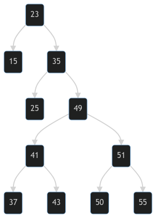
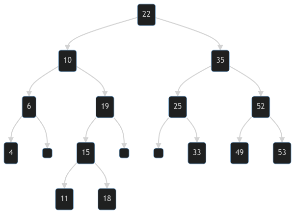

# 1
Implementá el TAD Pila utilizando la siguiente representación:

```ts
implement Stack of T where

type Stack of T = List of T
```

```kotlin
fun empty_stack() ret s: Stack of T
    s := empty()
end fun

proc push(in e: T, in/out s: Stack of T)
    addl(e, s)
end proc

fun is_empty_stack(s: Stack of T) ret b: Bool
    b := is_empty(s)
end fun

fun top(s: Stack of T) ret e: T
    e := head(s)
end fun

proc pop(in/out s: Stack of T)
    tail(s)
end proc
```

# 2
Implementá el TAD Pila utilizando la siguiente representación:

```ts
implement Stack of T where

type Node of T =    tuple
                        elem: T
                        next: pointer to (Node of T)
                    end tuple

type Stack of T = pointer to (Node of T)
```

```kotlin
fun empty_stack() ret s: Stack of T
    var node: pointer to (Node of T) 
    alloc(node)
    node := null

    s := node
end fun

proc push(in e: T, in/out s: Stack of T)
    var node: Node of T
    node := empty_stack()

    node.elem := e
    node.next := s

    s := node
end proc

fun is_empty_stack(s: Stack of T) ret b: Bool
    b := s = null
end fun

fun top(s: Stack of T) ret e: T
    e := s.elem
end fun

proc pop(in/out s: Stack of T)
    var node: Node of T
    node := s
    s := s.next

    free(node)
end proc
```

# 3
## a
Implementá el TAD Cola utilizando la siguiente representación, donde $N$ es una constante de tipo $nat$:

```ts
implement Queue of T where

type Queue of T =   tuple
                        elems: array[0..N-1] of T
                        size: nat
                    end tuple
```

```kotlin
fun empty_queue() ret q : Queue of T
    q.elems := []
    q.size := 0
end fun

proc enqueue (in/out q : Queue of T, in e : T)
    q.elems[q.size] := e
    q.size := q.size + 1
end proc

fun is_empty_queue(q : Queue of T) ret b : Bool
    b := q.size = 0
end fun

fun first(q : Queue of T) ret e : T
    e := q.elems[0]
end fun

proc dequeue (in/out q : Queue of T)
    q.size := q.size - 1

    for i := 0 to q.size - 1 do
        q.elems[i] := q.elems[i + 1]
end proc
```

## b
Implementá el TAD Cola utilizando un arreglo como en el inciso anterior, pero asegurando que todas las operaciones estén implementadas en orden constante.

> Ayuda1: Quizás convenga agregar algún campo más a la tupla. ¿Estamos obligados a que el primer elemento de la cola esté representado con el primer elemento del arreglo?

> Ayuda2: Buscar en Google aritmética modular.

```ts
implement Queue of T where

type Queue of T =   tuple
                        elems: array[0..N-1] of T
                        elemIndexes: array[0..N-1] of nat
                        size: nat
                    end tuple
```

```kotlin
fun empty_queue() ret q : Queue of T
    q.elems := []
    q.elemIndexes := []
    q.size := 0
end fun

proc enqueue (in/out q : Queue of T, in e : T)
    var i: nat, findPos: bool
    i := 0
    findPos := false

    while i < q.size && e > q.elems[i] do
        i := i + 1

    q.elemIndexes[q.size] := i
    q.elems[i] := e

    for j := 0 to q.size - 1 do
        if q.elemIndexes[j] => i then
            q.elemIndexes[j] := q.elemIndexes[j] + 1

        j := j + 1

    q.size := q.size + 1
end proc

fun is_empty_queue(q : Queue of T) ret b : Bool
    b := q.size = 0
end fun

fun first(q : Queue of T) ret e : T
    var i: nat
    i := q.elemIndexes[0]

    e := q.elems[i]
end fun

proc dequeue (in/out q : Queue of T)
    var eIndex: nat
    eIndex := q.elemIndexes[0]

    q.size := q.size - 1

    for j := 0 to q.size - 1 do
        q.elemIndexes[j] := q.elemIndexes[j + 1]

        if q.elemIndexes[j] >= eIndex then
            q.elemIndexes[j] := q.elemIndexes[j] - 1

    for j := i to q.size - 1 do
        q.elems[j] := q.elems[j + 1]
end proc
```

# 4
Completá la implementación del tipo Árbol Binario dada en el teórico, donde utilizamos la siguiente representación:

```ts
implement Tree of T where

type Node of T =    tuple
                        left: pointer to (Node of T)
                        value: T
                        right: pointer to (Node of T)
                    end tuple

type Tree of T = pointer to (Node of T)

// type Direction =    enumerate
//                         Left
//                         Right
//                     end enumerate
//
// type Path = List of Direction
```

```kotlin
fun empty_tree() ret t: Tree of T
    var node: pointer to (Node of T)
    alloc(node)
    node := null

    t := node
end fun

fun node(tl: Tree of T, e: T, tr: Tree of T) ret t: Tree of T
    var n: pointer to (Node of T)
    alloc(n)

    n.left := tl
    n.right := tr
    n.value := e

    t := n
end fun

fun is_empty_tree(t: Tree of T) ret b: Bool
    b := t = null
end fun

fun root(t: Tree of T) ret e: T
    e := t.value
end fun

fun left(t: Tree of T) ret tl: Tree of T
    tl := t.left
end fun

fun is_path(t: Tree of T, p: Path) ret b : Bool
    var dir: Direction, t_aux: Tree of T
    t_aux := t

    b := not is_empty_tree(t_aux) && not is_empty(p)
    while b do
        dir := head(p)
        tail(p)

        if dir = Right then
            t_aux := t_aux.right
        else
            t_aux := t_aux.left

        b := not is_empty_tree(t_aux) && not is_empty(p)
end fun

fun subtree_at(t : Tree of T, p : Path) ret t0 : Tree of T
    var dir: Direction

    t0 := t

    while not is_empty_tree(t0) && not is_empty(p) do
        dir := head(p)
        tail(p)

        if dir = Right then
            t0 := t0.right
        else
            t0 := t0.left
end fun

fun elem_at(t : Tree of T, p : Path) ret e : T
    var dir: Direction, t_aux: Tree of T
    t_aux := t

    while not is_empty(p) do
        dir := head(p)
        tail(p)

        if dir = Right then
            t_aux := t_aux.right
        else
            t_aux := t_aux.left

    e := t_aux.value
end fun

fun right(t : Tree of T) ret tr : Tree of T
    tr := t.right
end fun

fun height(t: Tree of T) ret n: Nat
    if is_empty_tree(t) then
        n := 0

    else 
        tr_empty := is_empty_tree(t.right)
        tl_empty := is_empty_tree(t.left)
        n := 1

        if !tr_empty || !tl_empty then
            var n_aux: nat
            n_aux := height(t.left)
            n := height(t.right)

            if n_aux > n then
                n := n_aux
end fun
```

# 5

Un *Diccionario* es una estructura de datos muy utilizada en programación. Consiste de una colección de pares `(Clave, Valor)`, a la cual le puedo realizar las operaciones:

- Crear un diccionario vacı́o.
- Agregar el par consistente de la clave k y el valor v. En caso que la clave ya se encuentre en el diccionario, se reemplaza el valor asociado por v.
- Chequear si un diccionario es vacı́o.
- Chequear si una clave se encuentra en el diccionario.
- Buscar el valor asociado a una clave k. Solo se puede aplicar si la misma se encuentra.
- Una operación que dada una clave k, elimina el par consistente de k y el valor asociado. Solo se puede aplicar si la clave se encuentra en el diccionario.
- Una operación que devuelve un conjunto con todas las claves contenidas en un diccionario. 

## a
Especificá el TAD diccionario indicando constructores y operaciones.

```kotlin
spec Dict of (K,V) where
```

donde $K$ y $V$ pueden ser cualquier tipo, asegurando que $K$ tenga definida una función que chequea igualdad.

```kotlin
spec Dict of (K,V) where

constructors
fun empty_dict() ret d: Dict of (K,V)
{- crea un diccionario vacío. -}

proc add_entry(in k: K, in v: V, in/out d: Dict of (K,V))
{- agrega el par consistente de la clave k y el valor v. O remplaza el valor asociado a k por v. -}

operations
fun is_empty_dict(d : Dict of (K,V)) ret b: bool
{- chequea si el diccionario d es vacı́o -}

fun exist_key(k: K, d: Dict of (K,V)) ret b: bool
{- chequea si la clave k se encuentra en el diccionario d. -}

fun search_key(k: K, d: Dict of (K,V)) ret b: bool
{- busca el valor asociado a la clave k en el diccionario d. -}
{- PRE: exist_key(key) -}

proc remove_entry(in k: K, in/out d: Dict of (K,V))
{- elimina el par consistente de k y el valor asociado en el diccionario d. -}
{- PRE: exist_key(key) -}

fun get_keys(d: Dict of (K,V)) ret ks: List of K
{- devuelve un conjunto con todas las claves contenidas en el diccionario d -}
```

## b
Implementá el TAD diccionario utilizando la siguiente representación:

```ts
implement Dict of (K,V) where

type Node of (K,V) =    tuple
                            left: pointer to (Node of (K,V))
                            key: K
                            value: V
                            right: pointer to (Node of (K,V))
                        end tuple

type Dict of (K,V) = pointer to (Node of (K,V))
```

Como invariante de representación debemos asegurar que el árbol representado por la estructura sea binario de búsqueda de manera que la operación de buscar un valor tenga orden logarı́tmico. Es decir, dado un nodo $n$, toda clave ubicada en el nodo de la derecha $n.right$, debe ser mayor o igual a $n.key$. Y toda clave ubicada en el nodo de la izquierda $n.left$, debe ser menor a $n.key$. Debes tener especial cuidado en la operación que agrega pares al diccionario.

```kotlin
fun empty_dict() ret d: Dict of (K,V)
    var node: pointer to (Node of (K,V))
    alloc(node)
    node := null

    d := node
end fun

proc add_entry(in k: K, in v: V, in/out d: Dict of (K,V))
    var node, node_aux: pointer to (Node of (K,V))
    node := d

    while node.key != k do
        if k > node.key then
            if is_empty_dict(node.right) then
                node_aux := empty_dict()
                node_aux.key := k

                node.right := node_aux

            node := node.right
        else
            if is_empty_dict(node.left) then
                node_aux := empty_dict()
                node_aux.key := k

                node.left := node_aux

            node := node.left

    node.value := v
end proc

operations
fun is_empty_dict(d : Dict of (K,V)) ret b: bool
    b := d = null
end fun

fun exist_key(k: K, d: Dict of (K,V)) ret b: bool
    var node: pointer to (Node of (K,V))
    node := d
    b := node.key = k

    while not is_empty_dict(node) && not b do
        if k > node.key then
            node := node.right
        else
            node := node.left

        b := node.key = k
end fun

fun search_key(k: K, d: Dict of (K,V)) ret v: V
    var node: pointer to (Node of (K,V))
    node := d

    while node.key != k do
        if k > node.key then
            node := node.right
        else
            node := node.left

    v := node.value
end fun

proc remove_entry(in k: K, in/out d: Dict of (K,V))
    var node, node_mov, node_aux: pointer to (Node of (K,V))
    var node_lft_is_empty, node_rgt_is_empty: bool
    node := d

    {- Encuentra el node (y su padre) con la clave k -}
    while node.key != k do
        node_aux := node

        if k > node.key then
            node := node.right
        else
            node := node.left

    node_lft_is_empty := is_empty_dict(node.left)
    node_rgt_is_empty := is_empty_dict(node.right)
    
    {- Si es una rama, reacomodamos sus hijos -}
    if not node_lft_is_empty || not node_rgt_is_empty then

        {- Nos aseguramos de elegir un hijo que no sea null -}
        if not node_rgt_is_empty then
            node_mov := node.right
        else
            node_mov := node.left

        {- Le asignamos al padre el nuevo hijo y avanzamos hacia él -}
        if k > node_aux.key then
            node_aux.right := node_mov
            node_aux := node_aux.right
        else
            node_aux.left := node_mov
            node_aux := node_aux.left

        {- node_mov es null, igual a node_aux o una rama que tenemos que relocalizar -}
        node_mov := node.left


        {- vemos que sea una rama que tengamos que relocalizar -}
        if not s_empty_dict(node_mov) && node_mov.key != node_aux.key then
            node := node_aux

            while not s_empty_dict(node_aux.left) do
                node_aux := node_aux.left

            node_aux.left := node_mov

    free(node)
end proc

fun get_keys(d: Dict of (K,V)) ret ks: List of K

    if not is_empty_dict(d) then
        addl(ks, d.key)

        if not is_empty_dict(d.left) then:
            concat(ks, get_keys(d.left))

        if not is_empty_dict(d.right) then:
            concat(ks, get_keys(d.right))

end fun
```

# 6
En un ABB cuyos nodos poseen valores entre 1 y 1000, interesa encontrar el número 363. ¿Cuáles de las siguientes secuencias no puede ser una secuencia de nodos examinados según el algoritmo de búsqueda? ¿Por qué?

1. ***2, 252, 401, 398, 330, 344, 397, 363.***
2. ***924, 220, 911, 244, 898, 258, 362, 363.***
3. ***925, 202, 911, 240, 912, 245, 363.***
4. ***2, 399, 387, 219, 266, 382, 381, 278, 363.***
5. ***935, 278, 347, 621, 299, 392, 358, 363.***

> El número 3 no es una secuncia válida, ya que `912` debería encontrarse a la derecha de `911` y al ser hijo de `240`, se encuentra a la izquierda.
> El número 5 no es una secuncia válida, ya que `299` debería encontrarse a la izquierda de `347` y al ser hijo de `621`, se encuentra a la derecha.

# 7
Dada la secuencia de números `23, 35, 49, 51, 41, 25, 50, 43, 55, 15, 47 y 37`, determinar el ABB que resulta al insertarlos exactamente en ese orden a partir del ABB vacı́o.



# 8
Determinar al menos dos secuencias de inserciones que den lugar al siguiente ABB:



- `22, 35, 25, 52, 33, 49, 53, 10, 6, 19, 4, 15, 11, 18`
- `22, 10, 6, 19, 4, 15, 11, 18, 35, 25, 52, 33, 49, 53`
- `22, 10, 35, 6, 19, 25, 52, 4, 15, 33, 49, 53, 11, 18`
