# 1
Ejecutar paso a paso, graficando las soluciones parciales, el algoritmo de $Prim$ que computa el _árbol generador mı́nimo_ sobre los grafos con nodos $\{1, 2, ..., 8\}$ y costos dados por una función $w$:

## a
$$
\begin{array}{cccccc}
w((1, 2)) = 7 & w((2, 3)) = 4 & w((3, 6)) = 4 & w((5, 6)) = 6 \\
w((1, 6)) = 3 & w((2, 4)) = 2 & w((3, 8)) = 6 & w((6, 7)) = 5 \\
w((1, 7)) = 5 & w((2, 5)) = 1 & w((4, 6)) = 8 & w((8, 5)) = 2 \\
w((1, 3)) = 3 & w((3, 4)) = 5 & w((5, 4)) = 3 & w((8, 7)) = 3 \\
\end{array}
$$


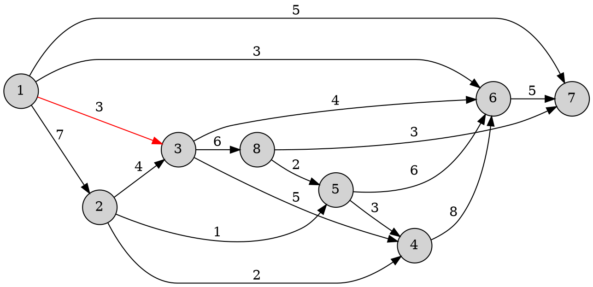


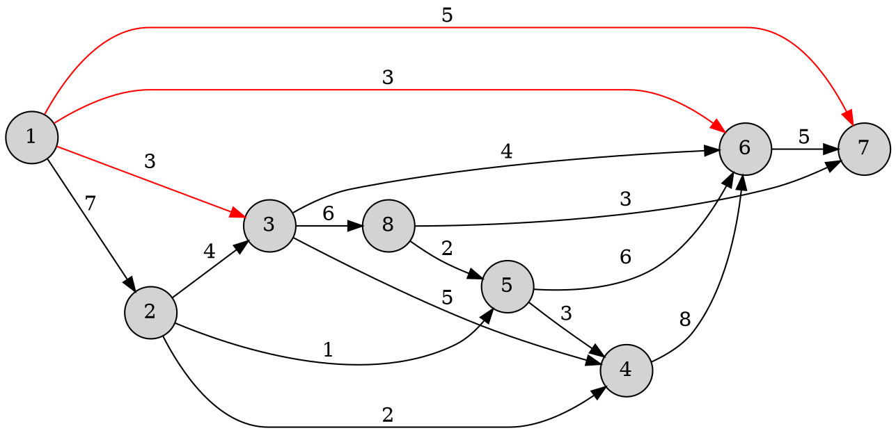

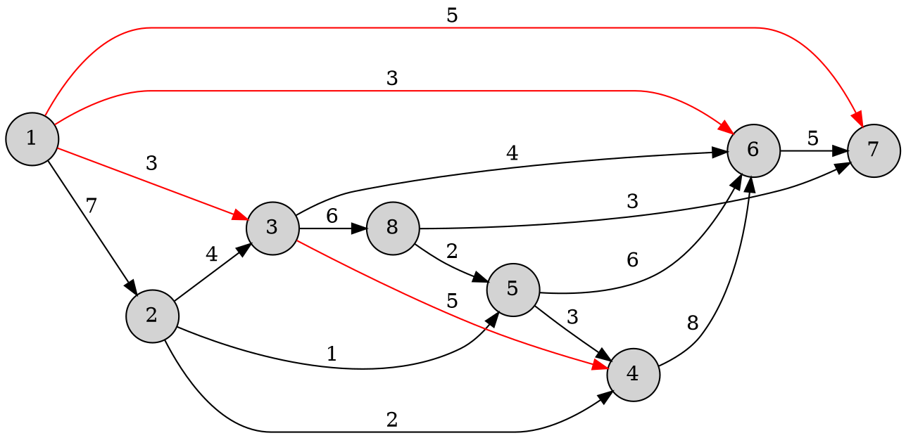

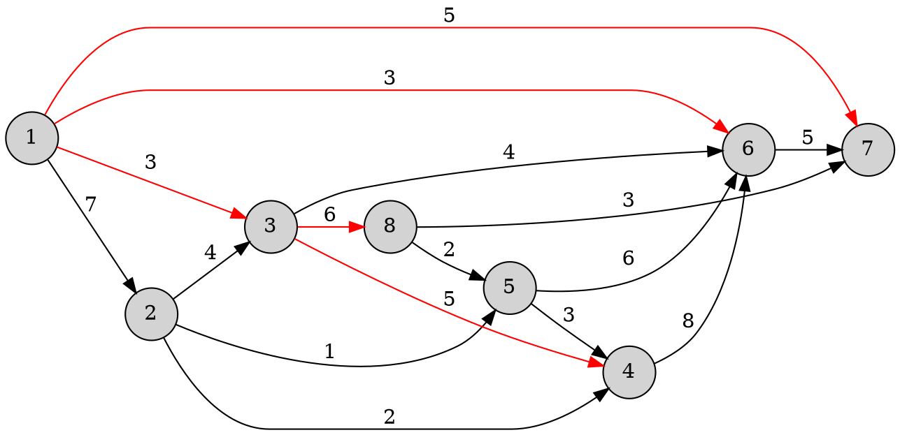

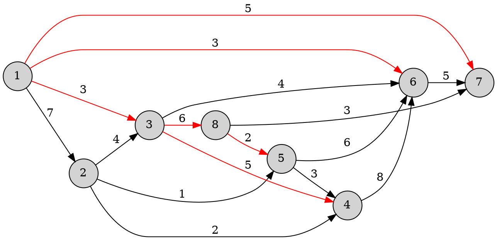

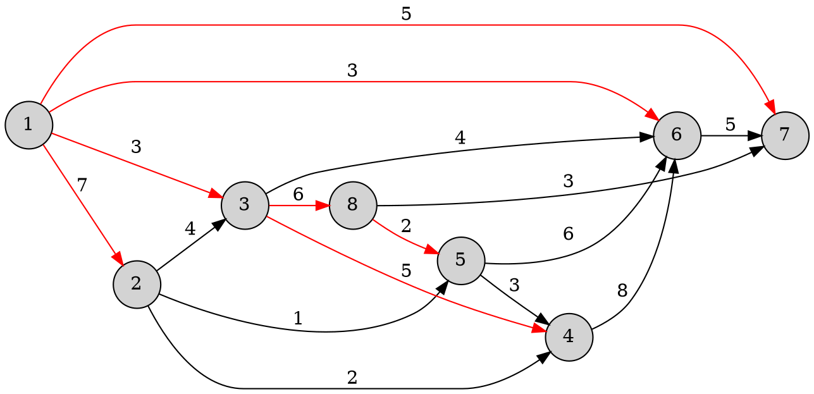

## b
$$
\begin{array}{cccccc}
w((1, 2)) = 3 & w((2, 3)) = 1 & w((3, 6)) = 3 & w((5, 6)) = 6 \\
w((1, 6)) = 2 & w((2, 4)) = 1 & w((3, 8)) = 7 & w((6, 7)) = 6 \\
w((1, 7)) = 8 & w((2, 5)) = 5 & w((4, 6)) = 1 & w((8, 5)) = 1 \\
w((1, 3)) = 1 & w((3, 4)) = 9 & w((5, 4)) = 2 & w((8, 7)) = 5 \\
\end{array}
$$

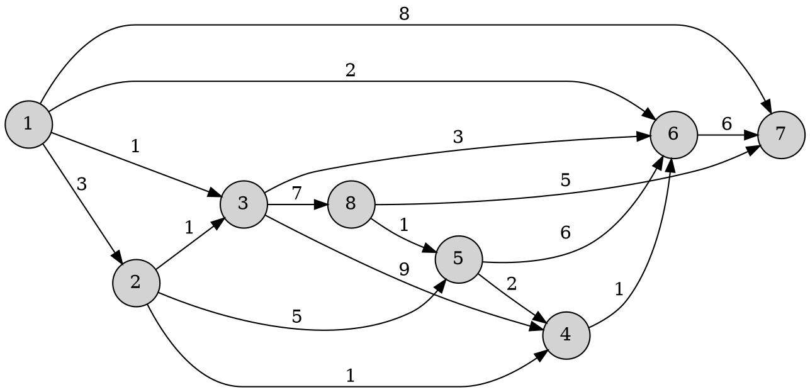

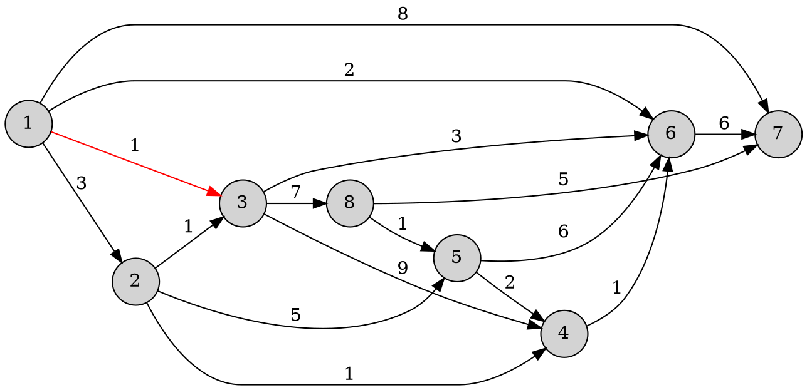

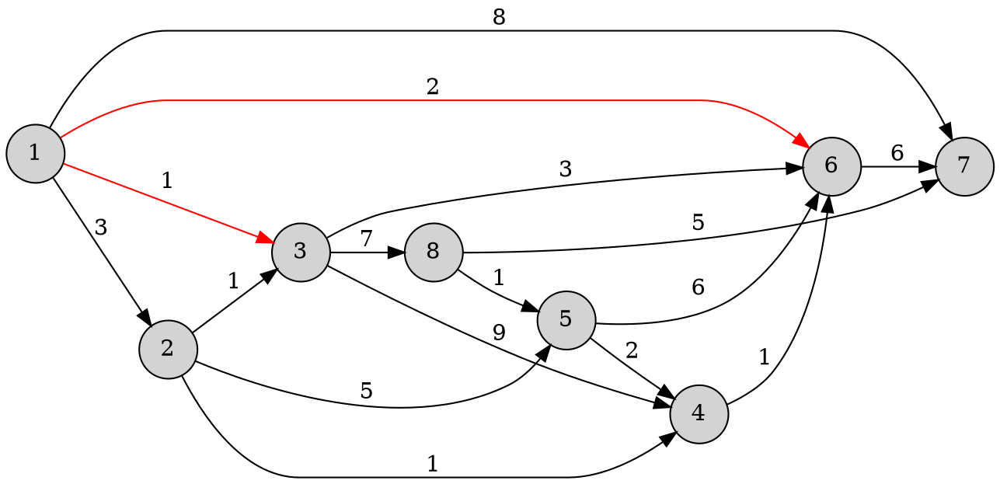

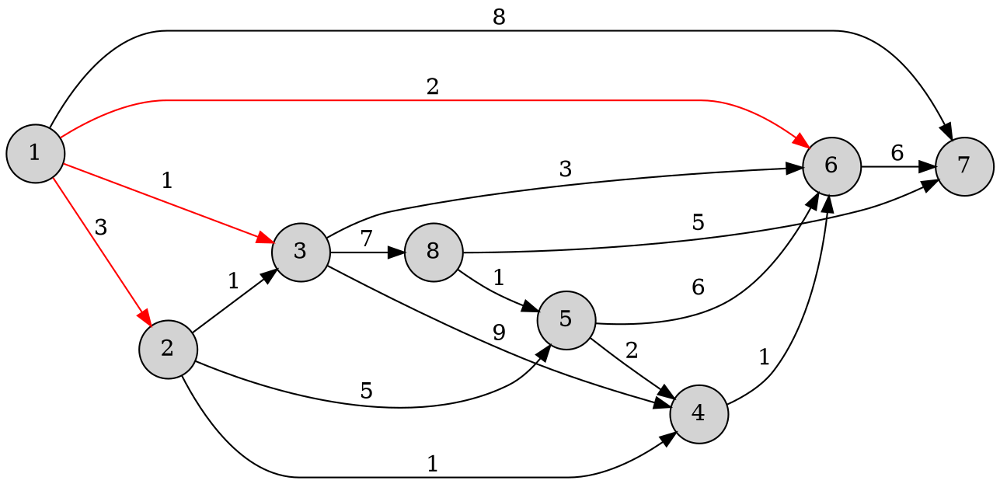

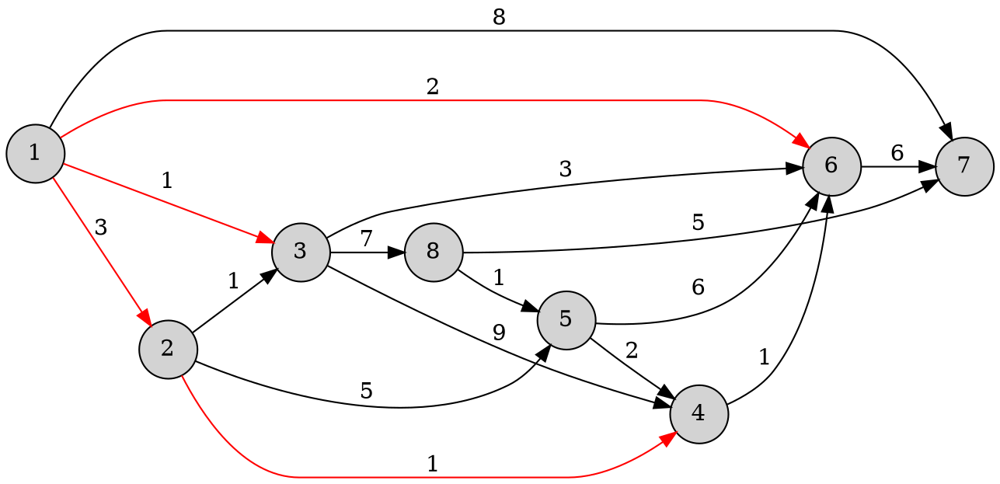

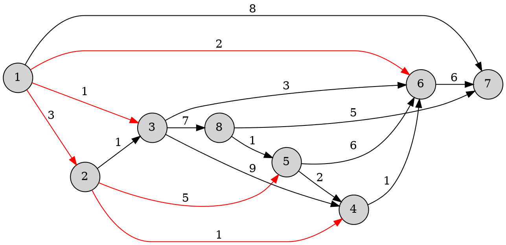

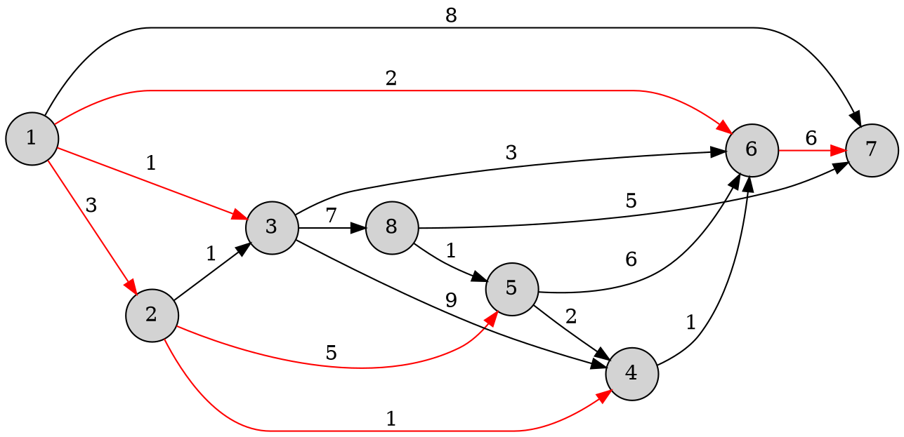

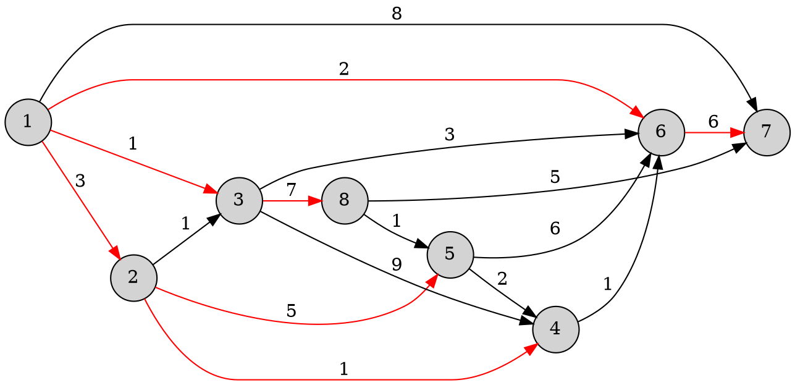

# 2
Ejecutar paso a paso el algoritmo de Dijkstra que computa el _camino de costo mı́nimo_ entre un nodo dado y los restantes nodos de un grafo, sobre los dos grafos especificados en el ejercicio anterior.

Considerar 1 como el nodo inicial. Explicitar en cada paso el conjunto de nodos para los cuales ya se ha computado el costo mı́nimo y el arreglo con tales costos.

## a


```dot
digraph {
	node [shape = circle, style = filled];
	rankdir = LR;
	1 [label = "&#8734;"]
	2 [label = "&#8734;"]
	3 [label = "&#8734;"]
	4 [label = "&#8734;"]
	5 [label = "&#8734;"]
	6 [label = "&#8734;"]
	7 [label = "&#8734;"]
	8 [label = "&#8734;"]
	
	1 -> 2 [label = 7];
	1 -> 3 [label = 3];
	1 -> 6 [label = 3];
	1 -> 7 [label = 5];

	2 -> 3 [label = 4];
	2 -> 4 [label = 2];
	2 -> 5 [label = 1];

	3 -> 4 [label = 5];
	3 -> 6 [label = 4];
	3 -> 8 [label = 6];

	4 -> 6 [label = 8];
	
	5 -> 4 [label = 3];
	5 -> 6 [label = 6];
	
	6 -> 7 [label = 5];
	
	8 -> 5 [label = 2];
	8 -> 7 [label = 3];
}
```

```dot
digraph {
	node [shape = circle, style = filled];
	rankdir = LR;
	1 [color = lightgreen, label = 0]
	2 [label = 7]
	3 [label = 3]
	4 [label = "&#8734;"]
	5 [label = "&#8734;"]
	6 [label = 3]
	7 [label = 5]
	8 [label = "&#8734;"]
	
	1 -> 2 [label = 7];
	1 -> 3 [label = 3];
	1 -> 6 [label = 3];
	1 -> 7 [label = 5];

	2 -> 3 [label = 4];
	2 -> 4 [label = 2];
	2 -> 5 [label = 1];

	3 -> 4 [label = 5];
	3 -> 6 [label = 4];
	3 -> 8 [label = 6];

	4 -> 6 [label = 8];
	
	5 -> 4 [label = 3];
	5 -> 6 [label = 6];
	
	6 -> 7 [label = 5];
	
	8 -> 5 [label = 2];
	8 -> 7 [label = 3];
}
```

```dot
digraph {
	node [shape = circle, style = filled];
	rankdir = LR;
	1 [color = lightgreen, label = 0]
	2 [label = 7]
	3 [color = lightgreen, label = 3]
	4 [label = 8]
	5 [label = "&#8734;"]
	6 [label = 3]
	7 [label = 5]
	8 [label = 9]
	
	1 -> 2 [label = 7];
	1 -> 3 [label = 3];
	1 -> 6 [label = 3];
	1 -> 7 [label = 5];

	2 -> 3 [label = 4];
	2 -> 4 [label = 2];
	2 -> 5 [label = 1];

	3 -> 4 [label = 5];
	3 -> 6 [label = 4];
	3 -> 8 [label = 6];

	4 -> 6 [label = 8];
	
	5 -> 4 [label = 3];
	5 -> 6 [label = 6];
	
	6 -> 7 [label = 5];
	
	8 -> 5 [label = 2];
	8 -> 7 [label = 3];
}
```

```dot
digraph {
	node [shape = circle, style = filled];
	rankdir = LR;
	1 [color = lightgreen, label = 0]
	2 [label = 7]
	3 [color = lightgreen, label = 3]
	4 [label = 8]
	5 [label = "&#8734;"]
	6 [color = lightgreen, label = 3]
	7 [label = 5]
	8 [label = 9]
	
	1 -> 2 [label = 7];
	1 -> 3 [label = 3];
	1 -> 6 [label = 3];
	1 -> 7 [label = 5];

	2 -> 3 [label = 4];
	2 -> 4 [label = 2];
	2 -> 5 [label = 1];

	3 -> 4 [label = 5];
	3 -> 6 [label = 4];
	3 -> 8 [label = 6];

	4 -> 6 [label = 8];
	
	5 -> 4 [label = 3];
	5 -> 6 [label = 6];
	
	6 -> 7 [label = 5];
	
	8 -> 5 [label = 2];
	8 -> 7 [label = 3];
}
```

```dot
digraph {
	node [shape = circle, style = filled];
	rankdir = LR;
	1 [color = lightgreen, label = 0]
	2 [label = 7]
	3 [color = lightgreen, label = 3]
	4 [label = 8]
	5 [label = "&#8734;"]
	6 [color = lightgreen, label = 3]
	7 [color = lightgreen, label = 5]
	8 [label = 9]
	
	1 -> 2 [label = 7];
	1 -> 3 [label = 3];
	1 -> 6 [label = 3];
	1 -> 7 [label = 5];

	2 -> 3 [label = 4];
	2 -> 4 [label = 2];
	2 -> 5 [label = 1];

	3 -> 4 [label = 5];
	3 -> 6 [label = 4];
	3 -> 8 [label = 6];

	4 -> 6 [label = 8];
	
	5 -> 4 [label = 3];
	5 -> 6 [label = 6];
	
	6 -> 7 [label = 5];
	
	8 -> 5 [label = 2];
	8 -> 7 [label = 3];
}
```

```dot
digraph {
	node [shape = circle, style = filled];
	rankdir = LR;
	1 [color = lightgreen, label = 0]
	2 [label = 7]
	3 [color = lightgreen, label = 3]
	4 [color = lightgreen, label = 8]
	5 [label = "&#8734;"]
	6 [color = lightgreen, label = 3]
	7 [color = lightgreen, label = 5]
	8 [label = 9]
	
	1 -> 2 [label = 7];
	1 -> 3 [label = 3];
	1 -> 6 [label = 3];
	1 -> 7 [label = 5];

	2 -> 3 [label = 4];
	2 -> 4 [label = 2];
	2 -> 5 [label = 1];

	3 -> 4 [label = 5];
	3 -> 6 [label = 4];
	3 -> 8 [label = 6];

	4 -> 6 [label = 8];
	
	5 -> 4 [label = 3];
	5 -> 6 [label = 6];
	
	6 -> 7 [label = 5];
	
	8 -> 5 [label = 2];
	8 -> 7 [label = 3];
}
```

```dot
digraph {
	node [shape = circle, style = filled];
	rankdir = LR;
	1 [color = lightgreen, label = 0]
	2 [label = 7]
	3 [color = lightgreen, label = 3]
	4 [color = lightgreen, label = 8]
	5 [label = 11]
	6 [color = lightgreen, label = 3]
	7 [color = lightgreen, label = 5]
	8 [color = lightgreen, label = 9]
	
	1 -> 2 [label = 7];
	1 -> 3 [label = 3];
	1 -> 6 [label = 3];
	1 -> 7 [label = 5];

	2 -> 3 [label = 4];
	2 -> 4 [label = 2];
	2 -> 5 [label = 1];

	3 -> 4 [label = 5];
	3 -> 6 [label = 4];
	3 -> 8 [label = 6];

	4 -> 6 [label = 8];
	
	5 -> 4 [label = 3];
	5 -> 6 [label = 6];
	
	6 -> 7 [label = 5];
	
	8 -> 5 [label = 2];
	8 -> 7 [label = 3];
}
```

```dot
digraph {
	node [shape = circle, style = filled];
	rankdir = LR;
	1 [color = lightgreen, label = 0]
	2 [label = 7]
	3 [color = lightgreen, label = 3]
	4 [color = lightgreen, label = 8]
	5 [color = lightgreen, label = 11]
	6 [color = lightgreen, label = 3]
	7 [color = lightgreen, label = 5]
	8 [color = lightgreen, label = 9]
	
	1 -> 2 [label = 7];
	1 -> 3 [label = 3];
	1 -> 6 [label = 3];
	1 -> 7 [label = 5];

	2 -> 3 [label = 4];
	2 -> 4 [label = 2];
	2 -> 5 [label = 1];

	3 -> 4 [label = 5];
	3 -> 6 [label = 4];
	3 -> 8 [label = 6];

	4 -> 6 [label = 8];
	
	5 -> 4 [label = 3];
	5 -> 6 [label = 6];
	
	6 -> 7 [label = 5];
	
	8 -> 5 [label = 2];
	8 -> 7 [label = 3];
}
```

```dot
digraph {
	node [shape = circle, style = filled];
	rankdir = LR;
	1 [color = lightgreen, label = 0]
	2 [color = lightgreen, label = 7]
	3 [color = lightgreen, label = 3]
	4 [color = lightgreen, label = 8]
	5 [color = lightgreen, label = 8]
	6 [color = lightgreen, label = 3]
	7 [color = lightgreen, label = 5]
	8 [color = lightgreen, label = 9]
	
	1 -> 2 [label = 7];
	1 -> 3 [label = 3];
	1 -> 6 [label = 3];
	1 -> 7 [label = 5];

	2 -> 3 [label = 4];
	2 -> 4 [label = 2];
	2 -> 5 [label = 1];

	3 -> 4 [label = 5];
	3 -> 6 [label = 4];
	3 -> 8 [label = 6];

	4 -> 6 [label = 8];
	
	5 -> 4 [label = 3];
	5 -> 6 [label = 6];
	
	6 -> 7 [label = 5];
	
	8 -> 5 [label = 2];
	8 -> 7 [label = 3];
}
```

## b

```dot
digraph {
	node [shape = circle, style = filled];
	rankdir = LR;
	1 [label = 1]
	2 [label = 2]
	3 [label = 3]
	4 [label = 4]
	5 [label = 5]
	6 [label = 6]
	7 [label = 7]
	8 [label = 8]
	
	1 -> 2 [label = 3];
	1 -> 3 [label = 1];
	1 -> 6 [label = 2];
	1 -> 7 [label = 8];

	2 -> 3 [label = 1];
	2 -> 4 [label = 1];
	2 -> 5 [label = 5];

	3 -> 4 [label = 9];
	3 -> 6 [label = 3];
	3 -> 8 [label = 7];

	4 -> 6 [label = 1];
	
	5 -> 4 [label = 2];
	5 -> 6 [label = 6];
	
	6 -> 7 [label = 6];
	
	8 -> 5 [label = 1];
	8 -> 7 [label = 5];
}
```

```dot
digraph {
	node [shape = circle, style = filled];
	rankdir = LR;
	1 [label = "&#8734;"]
	2 [label = "&#8734;"]
	3 [label = "&#8734;"]
	4 [label = "&#8734;"]
	5 [label = "&#8734;"]
	6 [label = "&#8734;"]
	7 [label = "&#8734;"]
	8 [label = "&#8734;"]
	
	1 -> 2 [label = 3];
	1 -> 3 [label = 1];
	1 -> 6 [label = 2];
	1 -> 7 [label = 8];

	2 -> 3 [label = 1];
	2 -> 4 [label = 1];
	2 -> 5 [label = 5];

	3 -> 4 [label = 9];
	3 -> 6 [label = 3];
	3 -> 8 [label = 7];

	4 -> 6 [label = 1];
	
	5 -> 4 [label = 2];
	5 -> 6 [label = 6];
	
	6 -> 7 [label = 6];
	
	8 -> 5 [label = 1];
	8 -> 7 [label = 5];
}
```

```dot
digraph {
	node [shape = circle, style = filled];
	rankdir = LR;
	1 [label = 0, color = lightgreen]
	2 [label = 3]
	3 [label = 1]
	4 [label = "&#8734;"]
	5 [label = "&#8734;"]
	6 [label = 2]
	7 [label = 8]
	8 [label = "&#8734;"]
	
	1 -> 2 [label = 3];
	1 -> 3 [label = 1];
	1 -> 6 [label = 2];
	1 -> 7 [label = 8];

	2 -> 3 [label = 1];
	2 -> 4 [label = 1];
	2 -> 5 [label = 5];

	3 -> 4 [label = 9];
	3 -> 6 [label = 3];
	3 -> 8 [label = 7];

	4 -> 6 [label = 1];
	
	5 -> 4 [label = 2];
	5 -> 6 [label = 6];
	
	6 -> 7 [label = 6];
	
	8 -> 5 [label = 1];
	8 -> 7 [label = 5];
}
```

```dot
digraph {
	node [shape = circle, style = filled];
	rankdir = LR;
	1 [label = 0, color = lightgreen]
	2 [label = 3]
	3 [label = 1, color = lightgreen]
	4 [label = 10]
	5 [label = "&#8734;"]
	6 [label = 2]
	7 [label = 8]
	8 [label = 8]
	
	1 -> 2 [label = 3];
	1 -> 3 [label = 1];
	1 -> 6 [label = 2];
	1 -> 7 [label = 8];

	2 -> 3 [label = 1];
	2 -> 4 [label = 1];
	2 -> 5 [label = 5];

	3 -> 4 [label = 9];
	3 -> 6 [label = 3];
	3 -> 8 [label = 7];

	4 -> 6 [label = 1];
	
	5 -> 4 [label = 2];
	5 -> 6 [label = 6];
	
	6 -> 7 [label = 6];
	
	8 -> 5 [label = 1];
	8 -> 7 [label = 5];
}
```

```dot
digraph {
	node [shape = circle, style = filled];
	rankdir = LR;
	1 [label = 0, color = lightgreen]
	2 [label = 3]
	3 [label = 1, color = lightgreen]
	4 [label = 10]
	5 [label = "&#8734;"]
	6 [label = 2, color = lightgreen]
	7 [label = 8]
	8 [label = 8]
	
	1 -> 2 [label = 3];
	1 -> 3 [label = 1];
	1 -> 6 [label = 2];
	1 -> 7 [label = 8];

	2 -> 3 [label = 1];
	2 -> 4 [label = 1];
	2 -> 5 [label = 5];

	3 -> 4 [label = 9];
	3 -> 6 [label = 3];
	3 -> 8 [label = 7];

	4 -> 6 [label = 1];
	
	5 -> 4 [label = 2];
	5 -> 6 [label = 6];
	
	6 -> 7 [label = 6];
	
	8 -> 5 [label = 1];
	8 -> 7 [label = 5];
}
```

```dot
digraph {
	node [shape = circle, style = filled];
	rankdir = LR;
	1 [label = 0, color = lightgreen]
	2 [label = 3, color = lightgreen]
	3 [label = 1, color = lightgreen]
	4 [label = 4]
	5 [label = 8]
	6 [label = 2, color = lightgreen]
	7 [label = 8]
	8 [label = 8]
	
	1 -> 2 [label = 3];
	1 -> 3 [label = 1];
	1 -> 6 [label = 2];
	1 -> 7 [label = 8];

	2 -> 3 [label = 1];
	2 -> 4 [label = 1];
	2 -> 5 [label = 5];

	3 -> 4 [label = 9];
	3 -> 6 [label = 3];
	3 -> 8 [label = 7];

	4 -> 6 [label = 1];
	
	5 -> 4 [label = 2];
	5 -> 6 [label = 6];
	
	6 -> 7 [label = 6];
	
	8 -> 5 [label = 1];
	8 -> 7 [label = 5];
}
```

```dot
digraph {
	node [shape = circle, style = filled];
	rankdir = LR;
	1 [label = 0, color = lightgreen]
	2 [label = 3, color = lightgreen]
	3 [label = 1, color = lightgreen]
	4 [label = 4, color = lightgreen]
	5 [label = 8]
	6 [label = 2, color = lightgreen]
	7 [label = 8]
	8 [label = 8]
	
	1 -> 2 [label = 3];
	1 -> 3 [label = 1];
	1 -> 6 [label = 2];
	1 -> 7 [label = 8];

	2 -> 3 [label = 1];
	2 -> 4 [label = 1];
	2 -> 5 [label = 5];

	3 -> 4 [label = 9];
	3 -> 6 [label = 3];
	3 -> 8 [label = 7];

	4 -> 6 [label = 1];
	
	5 -> 4 [label = 2];
	5 -> 6 [label = 6];
	
	6 -> 7 [label = 6];
	
	8 -> 5 [label = 1];
	8 -> 7 [label = 5];
}
```

```dot
digraph {
	node [shape = circle, style = filled];
	rankdir = LR;
	1 [label = 0, color = lightgreen]
	2 [label = 3, color = lightgreen]
	3 [label = 1, color = lightgreen]
	4 [label = 4, color = lightgreen]
	5 [label = 8, color = lightgreen]
	6 [label = 2, color = lightgreen]
	7 [label = 8]
	8 [label = 8]
	
	1 -> 2 [label = 3];
	1 -> 3 [label = 1];
	1 -> 6 [label = 2];
	1 -> 7 [label = 8];

	2 -> 3 [label = 1];
	2 -> 4 [label = 1];
	2 -> 5 [label = 5];

	3 -> 4 [label = 9];
	3 -> 6 [label = 3];
	3 -> 8 [label = 7];

	4 -> 6 [label = 1];
	
	5 -> 4 [label = 2];
	5 -> 6 [label = 6];
	
	6 -> 7 [label = 6];
	
	8 -> 5 [label = 1];
	8 -> 7 [label = 5];
}
```

```dot
digraph {
	node [shape = circle, style = filled];
	rankdir = LR;
	1 [label = 0, color = lightgreen]
	2 [label = 3, color = lightgreen]
	3 [label = 1, color = lightgreen]
	4 [label = 4, color = lightgreen]
	5 [label = 8, color = lightgreen]
	6 [label = 2, color = lightgreen]
	7 [label = 8, color = lightgreen]
	8 [label = 8]
	
	1 -> 2 [label = 3];
	1 -> 3 [label = 1];
	1 -> 6 [label = 2];
	1 -> 7 [label = 8];

	2 -> 3 [label = 1];
	2 -> 4 [label = 1];
	2 -> 5 [label = 5];

	3 -> 4 [label = 9];
	3 -> 6 [label = 3];
	3 -> 8 [label = 7];

	4 -> 6 [label = 1];
	
	5 -> 4 [label = 2];
	5 -> 6 [label = 6];
	
	6 -> 7 [label = 6];
	
	8 -> 5 [label = 1];
	8 -> 7 [label = 5];
}
```

```dot
digraph {
	node [shape = circle, style = filled];
	rankdir = LR;
	1 [label = 0, color = lightgreen]
	2 [label = 3, color = lightgreen]
	3 [label = 1, color = lightgreen]
	4 [label = 4, color = lightgreen]
	5 [label = 8, color = lightgreen]
	6 [label = 2, color = lightgreen]
	7 [label = 8, color = lightgreen]
	8 [label = 8, color = lightgreen]
	
	1 -> 2 [label = 3];
	1 -> 3 [label = 1];
	1 -> 6 [label = 2];
	1 -> 7 [label = 8];

	2 -> 3 [label = 1];
	2 -> 4 [label = 1];
	2 -> 5 [label = 5];

	3 -> 4 [label = 9];
	3 -> 6 [label = 3];
	3 -> 8 [label = 7];

	4 -> 6 [label = 1];
	
	5 -> 4 [label = 2];
	5 -> 6 [label = 6];
	
	6 -> 7 [label = 6];
	
	8 -> 5 [label = 1];
	8 -> 7 [label = 5];
}
```

# 3
Usted quiere irse de vacaciones y debe elegir una ciudad entre $K$ posibles que le interesan. Como no dispone de mucho dinero, desea que el viaje de ida hacia la ciudad pueda realizarse con a lo sumo $L$ litros de nafta.

## b
Dé un algoritmo que, dado un grafo representado por una matriz $E : array[1..n, 1..n]\ of\ Nat$, donde el elemento $E[i, j]$ indica el costo en litros de nafta necesario para ir desde la ciudad $i$ hasta la ciudad $j$; un conjunto $C$ de vértices entre $1$ y $n$, representando las ciudades que quieren visitarse; un vértice $v$, representando la ciudad de origen del viaje; y un natural $L$, indicando la cantidad de litros de nafta total que puede gastar; devuelva un conjunto $D$ de aquellos vértices de $C$ que puede visitar con los $L$ litros.

```ts
type Vertex = Nat

fun citiesToVisit(
	E: array[1..n, 1..n] of Nat,
	C: Set of Vertex,
	v: Vertex,
	L: Nat
) ret D: Set of Vertex
	var v_min, i_min: array[1..n] of Nat
	var C_copy: Set of Vertex
	var i: Vertex
	var l: Nat

	v_min := Dijkstra(E, v)
	C_copy := copy_set(C)
	D := empty_set()

	while not is_empty_set(C_copy) do
		i := get(C_copy)
		elim(C_copy, i)
		
		l := v_min[i]

		if L >= l then
			i_min := Dijkstra(E, i)
			l := l + i_min[v]
			
			if L >= l then
				add(D, i)

	set_destroy(C_copy)
end fun


fun Dijkstra(
	L: array[1..n, 1..n] of Nat, 
	v: Nat
) ret D: array[1..n] of Nat
	var c, c_aux: Nat
	var C, C_copy: Set of Nat

	C := empty_set()
	
	for i := 1 to n do 
		add(C, i)

	elim(C, v)
	
	for j := 1 to n do 
		D[j] := L[v, j]
		
	while not is_empty_set(C) do
		c := get(C)
		
		C_copy := copy_set(C)
		elim(C_copy, c)
		
		while not is_empty_set(C_copy) do
			c_aux := get(C_copy)
			elim(C_copy, c_aux)
			
			if D[c_aux] < D[c] then
				c := c_aux

		set_destroy(C_copy)
		elim(C, c)
		
		for j in C do 
			D[j] := min(D[j], D[c] + L[c, j])
end fun
```

## b
Ejecute el algoritmo implementado en el inciso anterior para el grafo descripto en el siguiente gráfico, con vértices $1, 2, ..., 11$, tomando $C = \{11, 5, 10, 7, 8\}$ como las ciudades de interés, disponiendo de $L = 40$ litros de nafta. ¿Cuáles son los posibles destinos de acuerdo a su presupuesto?

```dot
graph {
	node [shape = circle, style = filled];
	rankdir = LR;
	1 2 3 4 5 6 7 8 9 10 11
	
	1 -- 3 [label = 18];
	1 -- 4 [label = 27];
	1 -- 6 [label = 20];

	2 -- 1 [label = 9];
	2 -- 8 [label = 35];

	3 -- 7 [label = 14];
	8 -- 3 [label = 25];

	4 -- 7 [label = 7];
	4 -- 5 [label = 13];
	
	6 -- 5 [label = 12];
	
	9 -- 6 [label = 18];
	
	10 -- 9 [label = 10];
	
	11 -- 10 [label = 24];
	11 -- 2 [label = 39];
}
```

### v_min

```dot
graph {
	node [shape = circle, style = filled];
	rankdir = LR;
	1 [label = 0]
	2 [label = 9]
	3 [label = 18]
	4 [label = 27]
	5 [label = 32]
	6 [label = 20]
	7 [label = 32]
	8 [label = 43]
	9 [label = 38]
	10 [label = 48]
	11 [label = 48]
	
	1 -- 3 [label = 18];
	1 -- 4 [label = 27];
	1 -- 6 [label = 20];

	2 -- 1 [label = 9];
	2 -- 8 [label = 35];

	3 -- 7 [label = 14];
	8 -- 3 [label = 25];

	4 -- 7 [label = 7];
	4 -- 5 [label = 13];
	
	6 -- 5 [label = 12];
	
	9 -- 6 [label = 18];
	
	10 -- 9 [label = 10];
	
	11 -- 10 [label = 24];
	11 -- 2 [label = 39];
}
```

### i_min
Como es _no direccional_, $i\_min[v] = v\_min[i]$,  $\forall i, v$

### Resolución
Como $L = 40$, quedan descartados las ciudades $11$, $10$ y $8$, y en cuanto a las ciudades $5$ y $7$, podría ir hasta esas ciudades, pero luego no tendría combustible suficiente para volver.